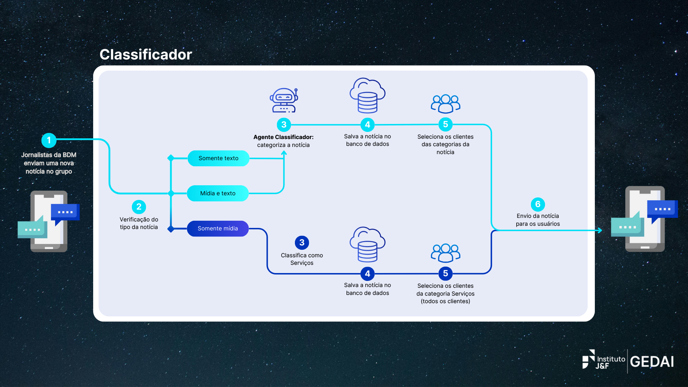
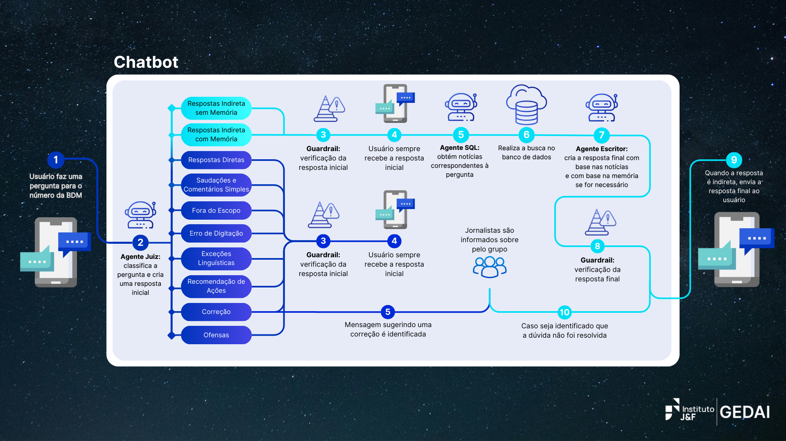

# Projeto BDM

## Introdução

### Projeto BDM

O **Projeto BDM** visa desenvolver dois sistemas principais para automação de processos relacionados ao BDM Online: um **Classificador de Notícias** e um **Chatbot Interativo**. O **Classificador** tem como objetivo categorizar notícias e enviá-las para os usuários com base em suas preferências. O **Chatbot**, por sua vez, responde a dúvidas dos usuários sobre o mercado de ações e utiliza informações extraídas de notícias armazenadas no banco de dados. A seguir, você encontrará informações detalhadas sobre as funcionalidades e tecnologias utilizadas em cada sistema.

### BDM Online

O **BDM Online** realiza curadoria em tempo real de notícias que impactam o mercado financeiro, acompanhando tendências e comportamentos relevantes. Atualmente, o serviço é disponibilizado por meio de uma comunidade exclusiva no WhatsApp para assinantes. Para saber mais, visite: https://www.bomdiamercado.com.br/

---

## Índice

- [Classificador](#classificador)
  - [Funcionalidades](#classificador-funcionalidades)
  - [Tecnologias](#classificador-tecnologias)
  - [Arquitetura](#classificador-arquitetura)
  
- [Chatbot](#chatbot)
  - [Funcionalidades](#chatbot-funcionalidades)
  - [Tecnologias](#chatbot-tecnologias)
  - [Arquitetura](#chatbot-arquitetura)

---

## Classificador

O sistema **Classificador** é responsável por categorizar notícias sobre o mercado de ações, que são retiradas de um grupo de WhatsApp do tipo portal de notícias, e enviá-las para usuários específicos, levando em consideração as categorias de interesse de cada usuário.

### Classificador Funcionalidades

- **Leitura de mensagens do WhatsApp**: captura as mensagens enviadas no grupo de notícias.
- **Categorização das mensagens**: classifica as notícias em uma ou mais categorias predefinidas.
- **Salvamento em banco de dados**: salva o conteúdo das notícias e suas categorias no banco de dados.
- **Envio automático de mensagens**: envia as notícias diretamente para os usuários, de acordo com suas categorias de interesse.

### Classificador Tecnologias

O sistema de classificação foi desenvolvido utilizando as seguintes tecnologias:

- **Python**: Linguagem de programação principal.
- **PostgreSQL**: Banco de dados utilizado para armazenar as notícias e suas categorias.
- **GreenAPI**: API utilizada para integrar o WhatsApp e enviar mensagens.
- **OpenAI GPT-4**: Inteligência artificial utilizada para classificar as notícias.
- **LangChain**: Framework para construir pipelines de IA com processamento de linguagem natural.

### Classificador Arquitetura

---

## Chatbot

O sistema **Chatbot** é responsável por responder às principais dúvidas dos usuários sobre o mercado de ações ou sobre os serviços fornecidos pela BDM, utilizando as notícias armazenadas no banco de dados.

### Chatbot Funcionalidades

- **Leitura de mensagens do WhatsApp**: captura as mensagens enviadas pelos usuários.
- **Resposta introdutória**: gera uma resposta inicial para a dúvida do usuário.
- **Sistema de RAG**: identifica as notícias relevantes no banco de dados que podem ser utilizadas para sanar a dúvida do usuário.
- **Resposta Final**: utiliza apenas as notícias do banco de dados para fornecer uma resposta ao usuário.
- **Envio automático de mensagens**: envia as respostas para os usuários via WhatsApp.

### Chatbot Tecnologias

O sistema de chatbot foi desenvolvido utilizando as seguintes tecnologias:

- **Python**: Linguagem de programação principal.
- **PostgreSQL**: Banco de dados utilizado para armazenar as notícias e as respostas.
- **GreenAPI**: API utilizada para integrar o WhatsApp e enviar mensagens.
- **OpenAI GPT-4**: Inteligência artificial para processar e gerar respostas.
- **Gemini**: API utilizada para realizar o sistema de guardrails, garantindo a qualidade das respostas.
- **LangChain**: Framework para construir pipelines de IA com processamento de linguagem natural.

### Chatbot Arquitetura

---
